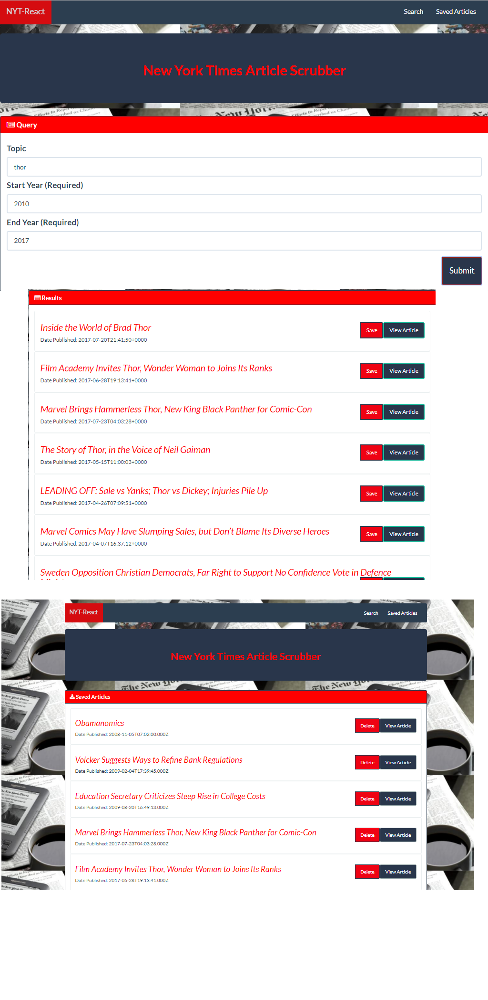

# NYT React Data Scraper

 

## Overview
  
  A React-based application that allows users to search for and save articles from The New York Times.

## Table of Contents

- [About NYT Article Miner](#about-nyt-article-miner)
- [More info about creating the app](#creating-the app)
- [Install the app locally](#downloading-and-installing)
- [Additional features to add](#additional-features-to-add)

##  About NYT Article Miner

This NYT Article Miner was created as a quick way to search for articles for research, personal or otherwise, in an efficient and organized manner.

You can 
    * Search for articles by a keyword or title
    * Set a beginning year date to start from
    * Set an ending date to finish

This allows you to search for all the articles relating to key search term during a defined time period.  Use this app to help you with professional research, school projects/homework, or to find other information that is stored in one of the best and trusted news sources in the world, the New York Times.

(***Remember that all articles are the property and the New York Times and can only be re-published with their express permission.  Always follow all local and state laws when using the information you retrieve with this application.  Also consider subscribing to the New York Times for subscriber only priveleges.***)

##  Creating the App

#### This project utilizes the following technologies:

1. Node
2. Express
3. MongoDB
4. Mongoose ODM
5. React

##  Downloading and Installing

Should you choose to clone this app to your computer, here are the package dependecies you'll need to install.  (I use yarn, but npm is the standard pm used....)

    Run `yarn init`. When that's finished, install and save these npm packages:
        1.  express         7.  morgan
        2.  body-parser     8.  history
        3.  mongoose        9.  path
        4.  body-parser     10. react
        5.  axios           11. react-dom
        6.  debug           12. react-router

##  Additional features to add

    --An option to add more articles to your results
    --Allow for a more specific time frame for searches
    --Option to save searches and add other fields like article author